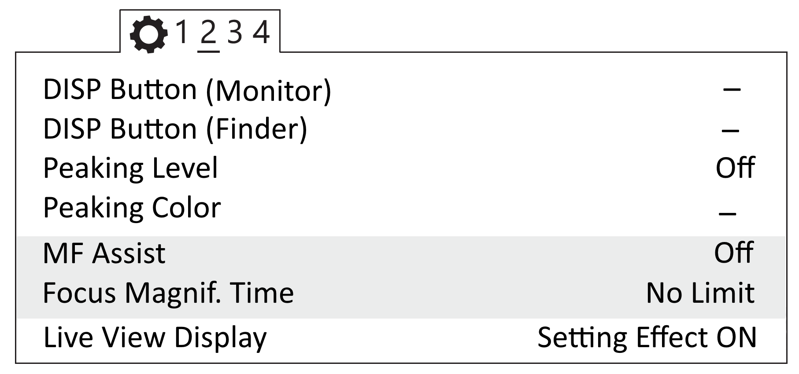
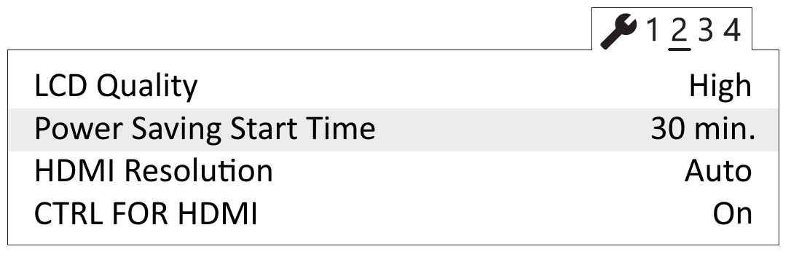
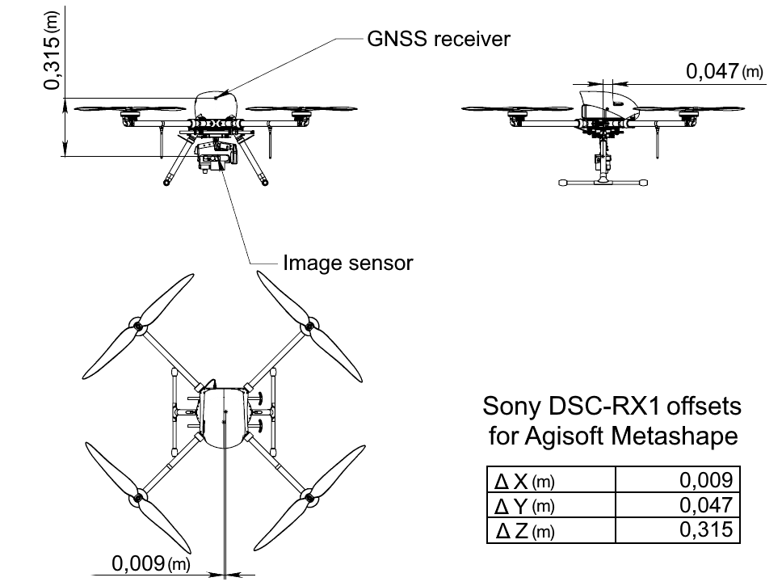

Camera setup
=========================

Sony DSC-RX1RM2 camera settings
------------------------------------------

.. |icon_key| image:: _static/_images/icon_key.png
    :width: 25

.. |icon_sd| image:: _static/_images/icon_sd.png
    :width: 25

.. |icon_set| image:: _static/_images/icon_set.png
    :width: 25

.. |icon_bag| image:: _static/_images/icon_bag.png
    :width: 25

Carefuly read camera's `operating instructions <https://www.sony.com/electronics/support/res/manuals/4469/44695771M.pdf>`_ to know about main control elements and functions before make settings.

* Set Mode dial in **S** (Shutter Priority) position.
* Use Montrol dial to set exposition **1/1000**.
* Set Exposure compensation dial in **0** (zero) position.
* Set Macro switching ring in **0,3m-∞** position.
* Set Focus mode dial in **MF** position.

Press **MENU** button to see settings menu and set this parameters:

* In Custom menu |icon_set| (tab 1) set **Auto Review — Off**.

.. figure:: _static/_images/menu2.png
   :width: 400
   :align: center

   Auto Review off

* In tab 2 set **MF Assist — Off** and **Focus Magnif. Time — No limit**.

   MF Assist is off and Focus Magnif. Time 

* In tab 3 set **MOVIE Button — Movie Mode Only**.

.. figure:: _static/_images/menu11.png
   :width: 400
   :align: center

   Set mode movie mode only for MOVIE button

* In Setup menu |icon_key| set **Power Saving Start Time — 30 min** (tab 2). 

   Power Saving Start Time

* In Memory card tool menu |icon_sd| set **File number — Reset**.

.. figure:: _static/_images/menu3.png
   :width: 400
   :align: center

   File number reset

* Press **Fn** (Function) button to set these settings:

.. csv-table:: 
   :align: center
   
   "**Drive Mode**", "**Single Shooting**"
   "**White Balance**", "**Auto AWB**"

Select **ISO** - **Auto** and set:

.. csv-table:: 
   :align: center
   
   "**ISO Minimum**", "**100**"
   "**ISO Maximum**", "**1600**"

Keep default parameters for other camera settings.

**Format SD card**

1) Select **MENU →** |icon_sd| [SD Card] **→ Format**

.. attention::  All data will be deleted!

**Reset** 

To reset all settings set:

1) Select **MENU** → |icon_key| **[Settings]**→ Initialize  → Reset Default**

.. attention::  Do not remove the battery while resetting the settings!

2) Set date and time after reset. Camera settings will not be saved, if you skiped that action.
3) Use **ON/OFF** switcher to turn off the camera. 
4) Do not disconnect the camera from AC or battery for 3 minutes to save the settings in the internal memory.

.. important:: The camera can display the message **E:61:00**. It means that the camera is focused on maximum range. The camera still works correctly.

Offset coordinates
--------------------------------------------------------

The antenna of the geodetic receiver is located inside the UAV. The phase center is offset from the center point of the camera lens.
The amount of offset should be taken, when you generate ortophotomaps and 3D models.

   Offsets coordinates for Sony DSC-RX1RM2 camera