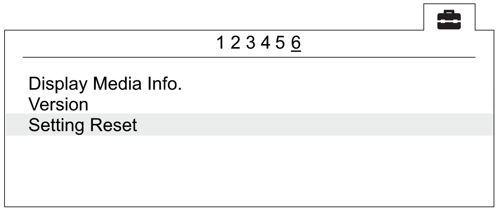

Camera setup
=========================

Camera types depends on delivery kit.

.. |icon_cam| image:: _static/_images/icon_cam.png
    :width: 25

.. |icon_key| image:: _static/_images/icon_key.png
    :width: 25

.. |icon_bag| image:: _static/_images/icon_bag.png
    :width: 25

.. |icon_sd| image:: _static/_images/icon_sd.png
    :width: 25

Sony DSC-RX1RM2 Settings
------------------------------------------

Before changing any settings, carfully read `Camera Operating Instructions <https://www.sony.com/electronics/support/res/manuals/4579/45798651M.pdf>`_ to get information about functions and control elements.

* Set mode to **S** (Exposure priority) by mode dial.
* Set exposure **1/800**  by control dial.
* Set exposure to **0** (Zero) by exposure compensation dial.
* Set macro to **0,3m-∞** by macro switching ring.
* Set focus mode dial to **MF**.

To set camera parameters, push **MENU** button, then select parameters according to the following instructions.

* Turn off **Auto review** in |icon_set| user settings menu (tab 2) and set **MOVIE Button** — **Movie Mode Only** (tab 6).

   Auto review off

.. figure:: _static/_images/menu_en.png
   :width: 400
   :align: center

   Movie mode only for MOVIE Button

* In |icon_bag| settings set **Pwr Save Start Time** — **30 min** (tab 2) and **File Number** — **Reset** (tab 5).

   Power save time setting

.. figure:: _static/_images/number_en.png
   :width: 400
   :align: center

   File number reset

Other settings should not be changed as they are used in default mode.

**SD Card Formating**

* In |icon_bag| settings menu (tab 5) select **Format**.

.. figure:: _static/_images/format_en.png
   :width: 400
   :align: center

   «Format» option

.. attention::  All data on SD card will be deleted!

**Settings reset**

1) In |icon_bag| settings menu (tab 6) select **Setting Reset**

   «Setting reset» option

.. attention::  Do not remove the battery during a reset process!

2) After camera reboot, you need to set **Timezone and date**, otherwise the settings will not be saved and this menu will appear at every turn on.

3) Use ON/OFF switcher to turn the camera off.
4) Wait 3 minutes for all settings to be saved (do not disconnect the battery or power cord).

.. important:: **«E:61:00»** error may appear on the screen, as the camera is focused to infinity. **This message will not interfere with camera's function**.

Sony DSC-RX1 Settings
------------------------------------------

Before changing any settings, carfully read `Camera Operating Instructions <https://www.sony.com/electronics/support/res/manuals/4469/44695771M.pdf>`_ to get information about functions and control elements.

* Set mode to **S** (Exposure priority) by mode dial.
* Set exposure **1/800**  by control dial.
* Set exposure to **0** (Zero) by exposure compensation dial.
* Set macro to **0,3m-∞** by macro switching ring.
* Set focus mode dial to **MF**.

To set camera parameters, push **MENU** button, then select parameters according to the following instructions.

* In user settings menu |icon_set| (tab 1) turn off **Automatic preview**.

.. figure:: _static/_images/menu2.png
   :width: 400
   :align: center

   Turn off automatic preview

* Turn off **RF assist** and set **Extend focus time** - **No restrictions** (2 tab).

.. figure:: _static/_images/menu13.png
   :width: 400
   :align: center

   Turn off RF assist and focus time extend setting.

* Set **MOVIE** - **Video mode only** (tab 3).

.. figure:: _static/_images/menu11.png
   :width: 400
   :align: center

   Set video mode only

* In settings menu |icon_key| tab 2 set **Power saving time** - **30 min** .

.. figure:: _static/_images/menu1.png
   :width: 400
   :align: center

   Power saving time 

* In memory card menu |icon_sd| select**File №** - **Clear**.

.. figure:: _static/_images/menu3.png
   :width: 400
   :align: center

   Clear file number

Other settings should not be changed as they are used in default mode.

**SD Card Formating**

1) Select **MENU →** |icon_sd| **[Memory card]** **→ Format**

**All Settings Reset**

Follow these steps to set default settings:

1) Select **MENU** → **Settings menu** → **INITIALISATION** → **Reset**

.. attention::  Do not remove the battery during a reset process!

2) After camera reboot, you need to set **Timezone and date**, otherwise the settings will not be saved and this menu will appear at every turn on.

3) Use ON/OFF switcher to turn the camera off.
4) Wait 3 minutes for all settings to be saved (do not disconnect the battery or power cord).

.. important:: **«E:61:00»** error may appear on the screen, as the camera is focused to infinity. **This message will not interfere with camera's function**.

Offset coordinates
--------------------------------------------------------

The antenna of the geodetic receiver is located inside the UAV. The phase center is offset from the center point of the camera lens.
The amount of offset should be taken, when you generate ortophotomaps and 3D models.

   Offsets coordinates for Sony DSC-RX1/RX1RM2 camera