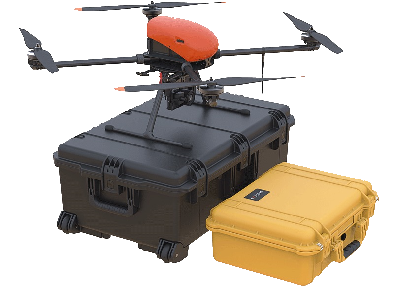

.. 101-doc documentation master file, created by
   sphinx-quickstart on Fri Dec 21 11:13:03 2018.
   You can adapt this file completely to your liking, but it should at least
   contain the root `toctree` directive.

Geoscan 401. Assembly and application
=======================================

General information
======================

Geoscan 401 — multifunctional system, that included in basic kit multirotor unmanned aerial vehicle (UAV) and Geoscan Planner software.

Kit
-----------------------

* Geoscan 401 unmanned aerial vehicle (UAV) 
* UAV's transport container 
* Payload: *

   * customized Sony DSC-RX1RM2 camera;
   * gyro-stabilized optical-electronic system with FullHD videocamera;
   * Topcon B111 GNSS receiver (L1-L2, GPS/GLONASS/BeiDou);
   * quantum magnitometer Geoscan QM-Rb-1.

* 37 V LiPo battery 
* Left rotation propeller  — 2 PCs
* Right rotation propeller — 2 PCs
* Battery charger
* Radio modem
* Radio modem antenna
* Radio modem pole
* SDHC card 64 Gb — 2 PCs *
* SD card 4 Gb — 2 PCs *
* USB cable
* UAV antenna

`*` — *Depends on equpment*

Specifications
-----------------

+--------------------------------------------+---------------------------------------------------------------------------+
|                  UAV type                  |                                 multirotor                                |
+--------------------------------------------+---------------------------------------------------------------------------+
|                   Engine                   |                     electric brushless — 4 PCs                            |
+--------------------------------------------+---------------------------------------------------------------------------+
|                  Battery                   |                                 37 V LiPo                                 |
+--------------------------------------------+---------------------------------------------------------------------------+
|                Launch/Landing              |              verticaly, in automatic mode, from/to 5 m area               |
+--------------------------------------------+---------------------------------------------------------------------------+
|                Flight duration             |                            up to 1 h                                      |
+--------------------------------------------+---------------------------------------------------------------------------+
|                 Max wind speed             |                                  12 m/s                                   |
+--------------------------------------------+---------------------------------------------------------------------------+
|                 Speed of flight            |                             0-50 km/h                                     |
+--------------------------------------------+---------------------------------------------------------------------------+
|            Min safe flight altitude        |                                  25 m                                     |
+--------------------------------------------+---------------------------------------------------------------------------+
|       Max flight altitude over start point |                                 500 m                                     |
+--------------------------------------------+---------------------------------------------------------------------------+
|                Max takeoff weight          |                                9,3 kg                                     |
+--------------------------------------------+---------------------------------------------------------------------------+
|               Max payload mass             |                                2,5 kg                                     |
+--------------------------------------------+---------------------------------------------------------------------------+
|    Preparation time before takeoff         |                                 5 min                                     |
+--------------------------------------------+---------------------------------------------------------------------------+
|                                            |                             folded  70х25х20 cm                           |
|         UAV's overall dimensions           +---------------------------------------------------------------------------+
|                                            |                            unfloded 150х150х43 cm                         |
+--------------------------------------------+--------------------------------------+------------------------------------+
|                                            |      2 cm/pix quality                |    0,95 km²                        |
|                                            +--------------------------------------+------------------------------------+
|     Photo shooting area in one flight      |      3 cm/pix quality                |    1,4 km²                         |
|                                            +--------------------------------------+------------------------------------+
|                                            |      5 cm/pix quality                |    2,1 km²                         |
+--------------------------------------------+---------------------------------------------------------------------------+
|                                            |                                -20 to +40 °C                              |
+        Operating temperature range:        +---------------------------------------------------------------------------+
|                                            |                        -40 to +20 °C  ("Arctic" battery)                  |
+--------------------------------------------+---------------------------------------------------------------------------+

Maintenance
-------------------

Visually inspect UAV for a damage after each flight.

In case, if a propellers are damaged, you can replace it by yourself using spare parts and tools from the kit.

If structural damage to the airframe or systems is detected, contact `Geoscan support <https://www.geoscan.aero/en/support>`_.

We recommended to send your UAV to the manufacturer for inspection and maintenance after 80 flights.

Storage
-------------

Geoscan 401 UAV (without battery) are recommended to be stored in a transport containers in dry rooms at a temperature of 5 to 25 °C and relative humidity not more than 80% without condensation. Service life — 2 years.

Batteries should be stored in a cool and dry place without direct sunlight, at a temperature of 5 to 25 °C and a relative humidity of 80% without condensation. The optimum voltage level when placing the battery to storage: 38,5 V. 

Service Life — 1 year.

.. toctree::
   :maxdepth: 2
   :hidden:
   :caption: Content:

   reference
   precautions
   uav
   nsu
   camera
   charger
   planner
   launch

